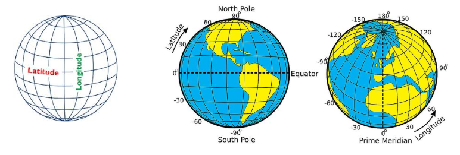
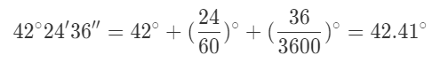

## Geo-Location on Clients and Servers

_Note: This description is too big for a single exam-question. It will be divided up into separate questions for the exam_  
In this period we will refresh our knowledge related to React Native, mainly focusing on geo-location features. We will introduce GeoJSON, and how to use it with plain JavaScript and with MongoDB. We will continue with the mini project

# Period-3 - Exam Preparation Questions

## Explain and demonstrate basic Geo-JSON, involving as a minimum, Points and Polygons

[GeoJSON](http://geojson.org/) is an open standard format designed for representing simple geographical features, along with their non-spatial attributes.

The features include points (therefore addresses and locations), line strings (therefore streets, highways and boundaries), polygons (countries, provinces, tracts of land), and multi-part collections of these types

**Point**

```json
{
	"type": "Feature",
	"geometry": {
		"type": "Point",
		"coordinates": [125.6, 10.1]
	},
	"properties": {
		"name": "Dinagat Islands"
	}
}
```

**Line**

```json
{
	"type": "LineString",
	"coordinates": [[0, 0], [10, 10]]
}
```

**Polygon**

```json
{
	"type": "Polygon",
	"coordinates": [[[0, 0], [10, 10], [10, 0], [0, 0]]]
}
```

## Explain and demonstrate ways to create Geo-JSON test data

You can setup objects like this:

```javascript
const gameArea = {
	type: 'Polygon',
	coordinates: [[[0, 0], [6, 0], [6, 6], [0, 6], [0, 0]]]
}
const players = [
	{
		type: 'Feature',
		properties: { name: 'Player-1' },
		geometry: {
			type: 'Point',
			coordinates: [3, 3]
		}
	},
	{
		type: 'Feature',
		properties: { name: 'Player-2' },
		geometry: {
			type: 'Point',
			coordinates: [7, 7]
		}
	}
]
```

However, for an full example check out the [geoSimple](https://github.com/sem4-fullstackjs/Period-3/tree/master/exerciseses/geoSimple) exercises

There's multiple sites out there where you can create Geo-JSON data, like this [gist](https://gist.github.com/aaronlidman/7894176?short_path=d0d520b), and [geojson.io](http://geojson.io/#map=2/20.0/0.0)

## Explain the typical order of longitude and latitude used by Server Side API’s and Client Side API’s

You can pinpoint any place on Earth using a single set of coordinates: latitude, longitude (and elevation).
Unfortunately, for us as developers, there is no “one-way” of handling this order.

-   On maps, and map-software the [common order](https://www.google.com/maps/@55.7898687,12.5634686,13) is:
    **[latitude, longitude]**
-   In many backend libraries/technologies, like for example GeoJSON, the order is the reverse: **[longitude, latitude, elevation]**



## Decimal Degrees vs DMS

One way to write spherical coordinates (latitudes and longitudes) is using **degrees-minutes-seconds (DMS)**. For example, the geographic coordinate expressed in degrees-minutes-seconds for New York City is:

-   **LATITUDE**: 40 degrees, 42 minutes, 51 seconds N
-   **LONGITUDE**: 74 degrees, 0 minutes, 21 seconds W

An alternative is to express geographic coordinates in decimal degrees. It’s just another way to represent that same location in a different format. For example, here is New York City in decimal degrees:

-   **LATITUDE**: 40.714
-   **LONGITUDE**: -74.006



## Explain and demonstrate a REST API that implements geo-features, using a relevant geo-library and plain JavaScript

[geoSimple](https://github.com/sem4-fullstackjs/Period-3/tree/master/exerciseses/geoSimple) - Write more about this question, and maybe use another example

## Explain and demonstrate a REST API that implements geo-features, using Mongodb’s geospatial queries and indexes.

## Explain and demonstrate a React Native Client that uses geo-components (Location, MapView, etc.)

## Demonstrate both server and client-side, of the geo-related parts of your implementation of the mini project
