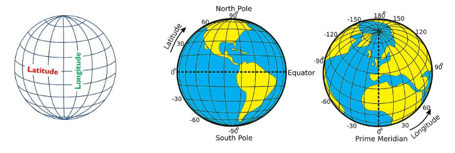
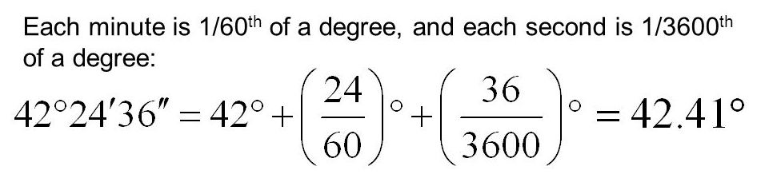

# GeoLocation

You can pinpoint any place on Earth using a single set of coordinates: latitude, longitude (and elevation).
Unfortunately, for us as developers, there is no “one-way” of handling this order.
. On maps, and map-software the [common order](https://www.google.com/maps/@55.7898687,12.5634686,13) is: 
**[latitude, longitude]**
- In many backend libraries/technologies, like for example GeoJSON, the order is the reverse: **[longitude, latitude, elevation]**



## Decimal Degrees vs DMS

One way to write spherical coordinates (latitudes and longitudes) is using **degrees-minutes-seconds (DMS)**. For example, the geographic coordinate expressed in degrees-minutes-seconds for New York City is:
- **LATITUDE**: 40 degrees, 42 minutes, 51 seconds N
- **LONGITUDE**: 74 degrees, 0 minutes, 21 seconds W

An alternative is to express geographic coordinates in decimal degrees. It’s just another way to represent that same location in a different format. For example, here is New York City in decimal degrees:
- **LATITUDE**: 40.714
- **LONGITUDE**: -74.006 



## GeoJson

[GeoJSON](http://geojson.org/) is an open standard format designed for representing simple geographical features, along with their non-spatial attributes. 

The features include points (therefore addresses and locations), line strings (therefore streets, highways and boundaries), polygons (countries, provinces, tracts of land), and multi-part collections of these types

**Point**
```json
{
  "type": "Feature",
  "geometry": {
    "type": "Point",
    "coordinates": [125.6, 10.1]
  },
  "properties": {
    "name": "Dinagat Islands"
  }
}
```

**Line**
```json
{ 
  "type": "LineString",
  "coordinates": [[0, 0], [10, 10]] 
}
```

**Polygon**
```json
{
  "type": "Polygon",
  "coordinates": [
    [
      [0, 0], [10, 10], [10, 0], [0, 0]
    ]
  ]
}
```